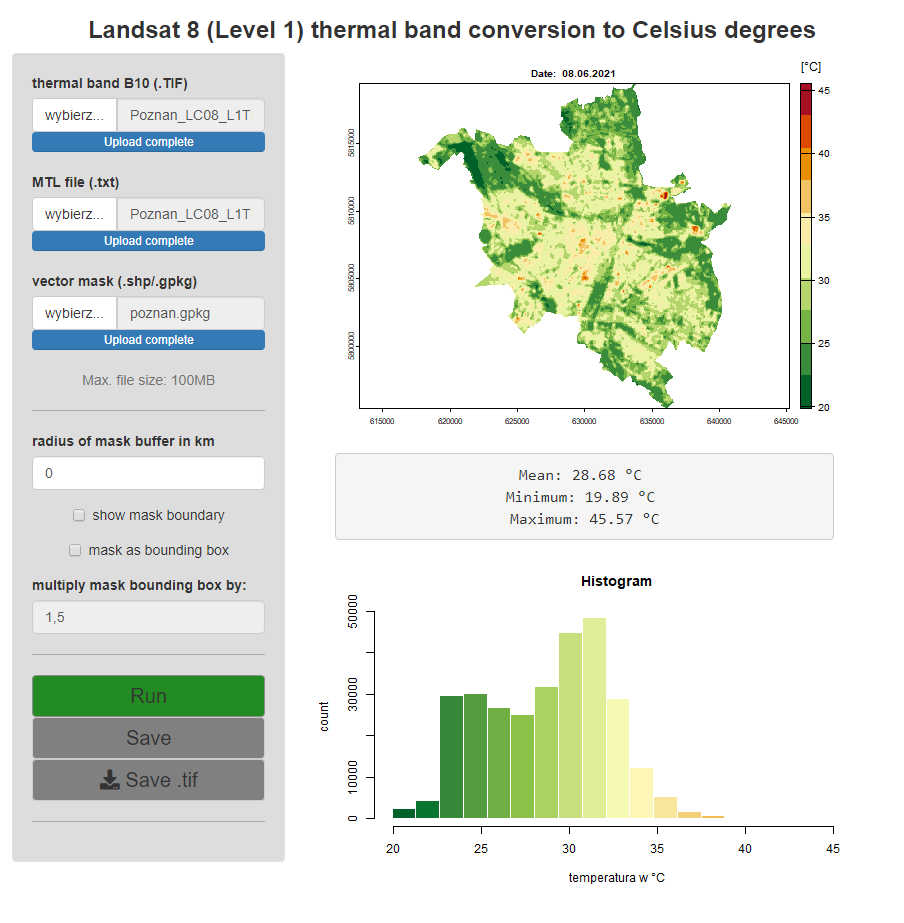

# Thermal-landsat app

This Shiny application is a tool for conversion Landsat 8 (Level 1) thermal band from Digital Numbers (DN) to Birghtness Temperature (BT) in Celsius degrees.
User must provide .TIF raster file which contains thermal data and then, click Run button.
There are some additional options such as:
- attach MTL file (.txt) with Landsat scene metadata, if user knows that B10 radiance values or K1/K2 constants are different then default (this is recommended option)
- attach vector mask file (.shp/.gpkg); application will clip source raster to this boundary
- it is also possible to use extent of features in mask layer instead of clipping raster exactly to their boundaries; user can also specify factor which will be used to multiply extent of mask layer to create custom bounding box
- after running conversion, simple map will be displayed as well as several statistics and histogram of output raster values
- user can save output raster with values in Celsius degrees to .tif file

## How to use

### Run app in RStudio by GitHub and Shiny package
```r
shiny::runGitHub("landsat-thermal", "TomekMatuszek")
```


